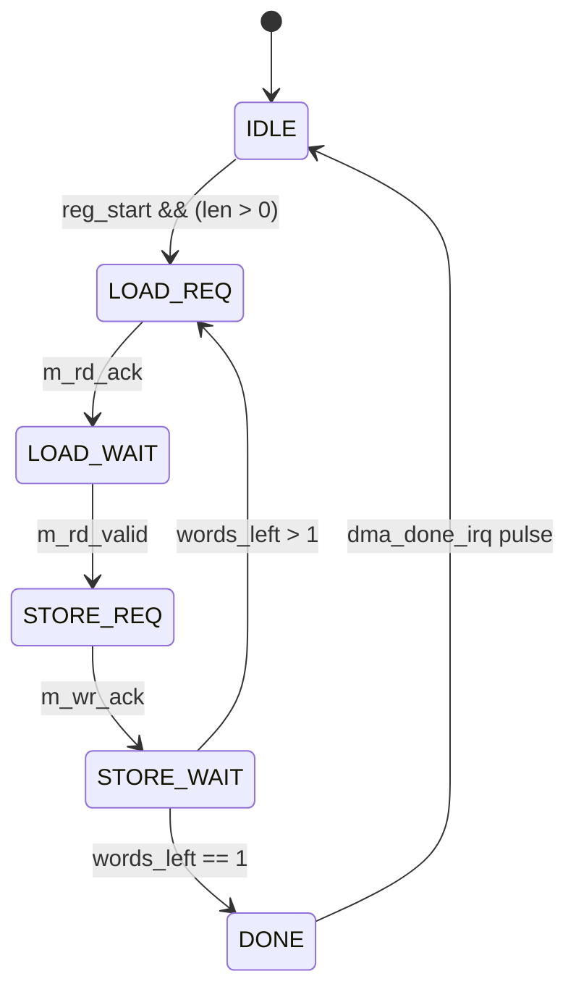
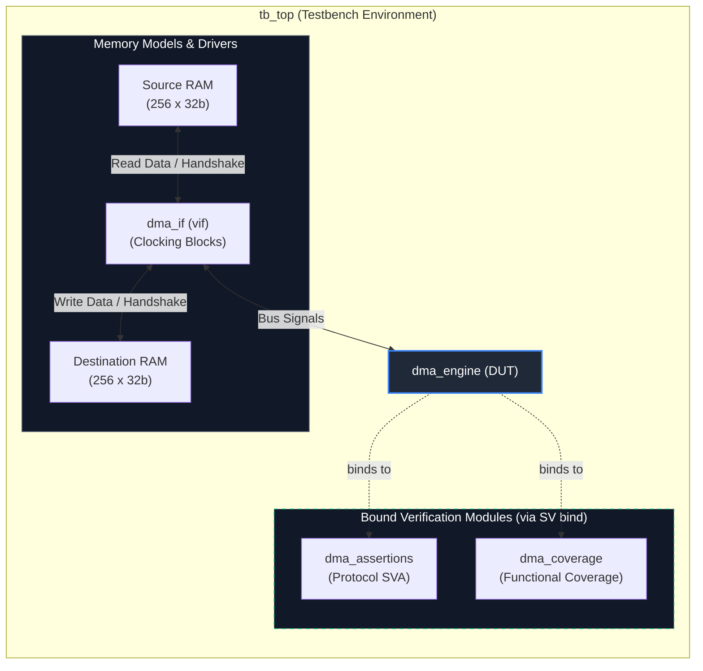

# Synthesizable 32-Bit DMA Engine & Verification Suite

A synthesizable, register-programmable Direct Memory Access (DMA) engine with an out-of-the-box SystemVerilog verification suite. The verification environment includes SystemVerilog Assertions (SVA), a functional coverage model, a standard interface with clocking blocks, and a self-checking testbench utilizing the SV `bind` directive for non-intrusive monitoring.

---

## 1. Architectural & DUT Specification

### 1.1 Overview
The DMA engine offloads bulk data transfers between source and destination memory spaces via independent master read and write bus interfaces.

* **Data Path Width:** 32-bit parameterized bus (`DATA_WIDTH = 32`).
* **Address Space:** 32-bit byte-addressed, word-aligned memory (`ADDR_WIDTH = 32`).
* **Addressing Model:** Auto-incrementing word-aligned pointers (`curr_src_addr + 4`, `curr_dst_addr + 4`).
* **Architecture:** Store-and-forward architecture with a single-stage intermediate data register.

### 1.2 Top-Level Interface Signals

| Signal Name | Direction | Width | Description |
| :--- | :--- | :--- | :--- |
| `clk` | Input | 1 | Master system clock |
| `rst_n` | Input | 1 | Asynchronous active-low reset |
| **Control / Register Interface** | | | |
| `ctrl_wr_en` | Input | 1 | Register write enable |
| `ctrl_addr` | Input | 4 | Byte-aligned register offset (`0x0` to `0xC`) |
| `ctrl_wdata` | Input | `DATA_WIDTH` | Configuration write data |
| `ctrl_rdata` | Output | `DATA_WIDTH` | Configuration readback data |
| **Master Read Interface** | | | |
| `m_rd_addr` | Output | `ADDR_WIDTH` | Source memory read address |
| `m_rd_req` | Output | 1 | Read transfer request strobe |
| `m_rd_ack` | Input | 1 | Read request acknowledge from source slave |
| `m_rd_data` | Input | `DATA_WIDTH` | Read data bus |
| `m_rd_valid` | Input | 1 | Read data valid qualifier |
| **Master Write Interface** | | | |
| `m_wr_addr` | Output | `ADDR_WIDTH` | Destination memory write address |
| `m_wr_data` | Output | `DATA_WIDTH` | Destination write data bus |
| `m_wr_req` | Output | 1 | Write transfer request strobe |
| `m_wr_ack` | Input | 1 | Write request acknowledge from destination slave |
| **Status / Interrupts** | | | |
| `dma_busy` | Output | 1 | Asserted high during an active transfer |
| `dma_done_irq` | Output | 1 | Single-cycle interrupt pulse upon completion |

### 1.3 Register Map

| Offset | Register | Access | Description |
| :--- | :--- | :--- | :--- |
| `0x0` | `SRC_ADDR` | R/W | Base address of source memory (32-bit aligned). |
| `0x4` | `DST_ADDR` | R/W | Base address of destination memory (32-bit aligned). |
| `0x8` | `LEN` | R/W | Transfer length in **32-bit words**. |
| `0xC` | `CTRL / STATUS` | R/W | **Bit [0]:** `START` (Write `1` to trigger, auto-cleared).<br>**Bit [1]:** `DONE_IRQ` (Read status).<br>**Bit [2]:** `BUSY` (Read status). |

### 1.4 Finite State Machine (FSM)

### 1.4 Finite State Machine (FSM)




* **`IDLE` (3'b000):** Waits for host write to `REG_CTRL` with bit 0 high. Latches working addresses and length counters.
* **`LOAD_REQ` (3'b001):** Drives `m_rd_req` and `m_rd_addr = curr_src_addr` until acknowledged by `m_rd_ack`.
* **`LOAD_WAIT` (3'b010):** Lowers `m_rd_req`, samples `m_rd_data` on `m_rd_valid`, and updates `curr_src_addr += 4`.
* **`STORE_REQ` (3'b011):** Drives `m_wr_req`, `m_wr_addr = curr_dst_addr`, and `m_wr_data = data_buffer` until `m_wr_ack` arrives.
* **`STORE_WAIT` (3'b100):** Updates `curr_dst_addr += 4` and decrements `words_left`. If `words_left == 0`, enters `DONE`; else returns to `LOAD_REQ`.
* **`DONE` (3'b101):** Fires `dma_done_irq` for 1 clock cycle and transitions to `IDLE`.

---

## 2. Verification Architecture

The test environment leaves RTL source code untouched by binding protocol assertions and functional coverage directly to the core instance via SystemVerilog `bind`.

## 2. Verification Architecture

The test environment leaves RTL source code untouched by binding protocol assertions and functional coverage directly to the core instance via SystemVerilog `bind`.



### 2.1 File Structure

| File | Language | Purpose |
| :--- | :--- | :--- |
| `dma_engine.v` | Verilog-2001 | Synthesizable DMA core RTL with control registers and bus masters. |
| `dma_if.sv` | SystemVerilog | Signal bundle, modports, and clocking block definitions. |
| `dma_assertions.sv` | SystemVerilog | Concurrent assertions (SVA) tracking protocol and alignment rules. |
| `dma_coverage.sv` | SystemVerilog | Covergroups tracking register writes, transfer lengths, and handshakes. |
| `tb_top.sv` | SystemVerilog | Top-level module with memory models, stimulus driver, and `bind` instances. |

---

## 3. SystemVerilog Assertions (SVA)

Bound directly to `dma_engine` in `dma_assertions.sv`. Evaluated concurrently on `posedge clk`, qualified with `disable iff (!rst_n)`.

| Assertion Label | Formal Property | Failure Impact |
| :--- | :--- | :--- |
| `assert_rd_addr_aligned` | `m_rd_req \|-> (m_rd_addr[1:0] == 2'b00)` | Misaligned read address causes unaligned bus exceptions. |
| `assert_wr_addr_aligned` | `m_wr_req \|-> (m_wr_addr[1:0] == 2'b00)` | Misaligned write address causes unaligned bus exceptions. |
| `assert_rd_addr_stable` | `(m_rd_req && !m_rd_ack) \|=> ($stable(m_rd_addr) && m_rd_req)` | Master changes read address before transaction is accepted. |
| `assert_wr_payload_stable` | `(m_wr_req && !m_wr_ack) \|=> ($stable(m_wr_addr) && $stable(m_wr_data) && m_wr_req)` | Write data or address mutates mid-handshake. |
| `assert_idle_on_reset` | `$rose(rst_n) \|-> (!dma_busy && !dma_done_irq)` | Engine initiates or flags transfer without software trigger. |
| `assert_done_drops_busy` | `dma_done_irq \|=> !dma_busy` | Engine reports busy after emitting completion IRQ. |
| `assert_no_simultaneous_rw` | `!(m_rd_req && m_wr_req)` | Read and write channels violate half-duplex mutual exclusion. |

---

## 4. Functional Coverage Model

Covergroups implemented in `dma_coverage.sv` measure test scenario completeness:

* **Covergroup `cg_registers`** (Sampled on active register writes: `ctrl_wr_en && rst_n`):
  * `cp_reg_address`: Checks write access coverage across all offsets (`0x0`, `0x4`, `0x8`, `0xC`).
  * `cp_transfer_len`: Tracks transfer length boundaries:
    * `bins zero_len    = {0}` (Zero-length edge case)
    * `bins single_wd   = {1}` (Single-word transfer)
    * `bins small_burst = {[2:4]}`
    * `bins med_burst   = {[5:16]}`
    * `bins large_burst = {[17:256]}`
  * `cp_ctrl_commands`: Ensures exercise of `START` (`2'b01`) and `SOFT_RESET` (`2'b10`).

* **Covergroup `cg_bus_handshake`** (Sampled on `@(posedge clk)`):
  * `cp_rd_ack_latency`: Confirms immediate read acceptance (`m_rd_req && m_rd_ack`).
  * `cp_wr_ack_latency`: Confirms immediate write acceptance (`m_wr_req && m_wr_ack`).
  * `cp_irq_event`: Confirms triggering and observation of `dma_done_irq`.

---

## 5. Simulation Commands

### 5.1 Synopsys VCS
```bash
vcs -sverilog +v2k -timescale=1ns/1ps \
    dma_engine.v dma_if.sv dma_assertions.sv dma_coverage.sv tb_top.sv \
    -cm line+cond+fsm+tgl+branch+assert \
    -debug_access+all -l compile_vcs.log

./simv -cm line+cond+fsm+tgl+branch+assert -l sim_vcs.log
urg -dir simv.vdb -format both -report urgRepor
